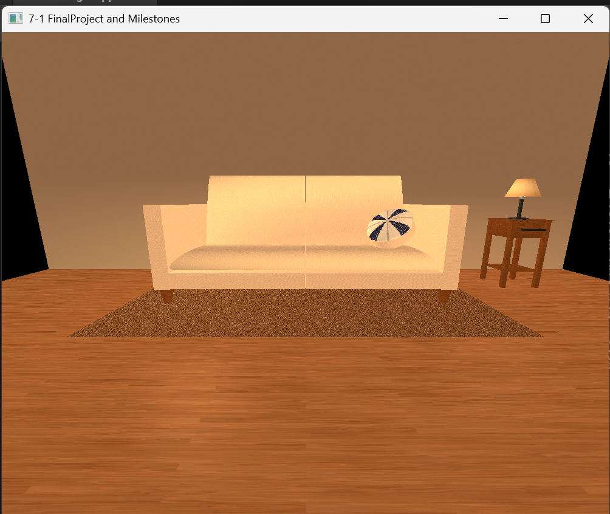
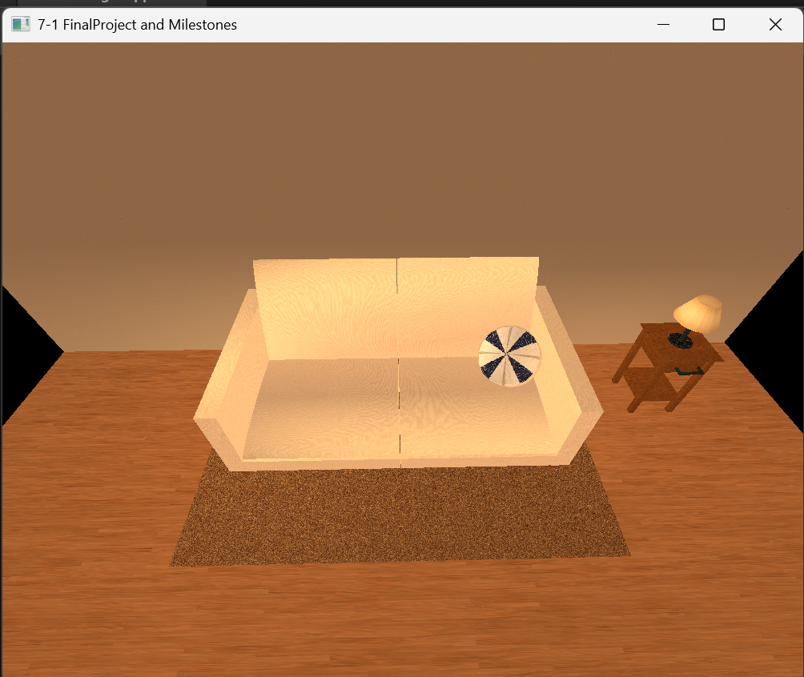
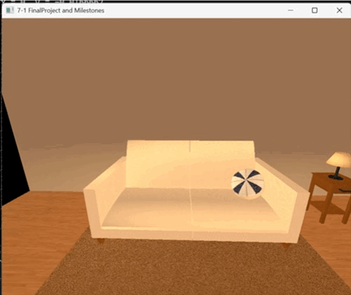

# SNHU-CS330
*This is my final project and reflection for the course.*

## Project Checklist ✅
- [x] Make 3D shapes (at least 4)
- [x] Build one shape using smaller shapes
- [x] Add textures to some shapes
- [x] Add lights to the scene (at least 2)
- [x] Move camera using keyboard
- [x] Use mouse scroll to control camera speed
- [x] Switch between 3D and 2D views

## Preview 👀

## Reflection 📝
### **1. How do I approach designing software?**
How I approach designing software is by first outlining the entire project and defining the problem I'm trying to solve. Next, I break the outline down into steps that solve the problem. This approach allows me to create code that's structured, easy to test and maintain.

  - #### **What new design skills has your work on the project helped you to craft?**
> A new design skill I developed when working on this project is my improved attention to detail. When creating the 3D scene things like shape selection, texture choice and even the smallest adjustment to placement, lighting and adjusting material values can improve the appearance.

  - #### **What design process did you follow for your project work?**
After breaking down each complex object I planned to build into individual shapes, I began to build each object piece by piece, compiling and making changes before moving to the next shape. After all the the objects were built, I gathered all the textures and applied them, changing them so everything looks like it belongs. I followed the same trial and error approach for setting up the adjusting the values for lighting and materials as well. 

  - #### **How could tactics from your design approach be applied in future work?**
Breaking down the project into smaller steps can make the project seem less overwhelming and helps maintain structure and promote code tideness. Using a trial and error approach can help refine things that require extreme attention to detail and reduce the amount of testing required at the end.

### **2. How do I approach developing programs?**
To develop programs I take a similiar approach to the design process. I define the problem and brainstorm solutions and project structure. Followed by breaking the solution down into smaller steps and then coding each step while testing each before moving to the next.

  - #### **What new development strategies did you use while working on your 3D scene?**
A new developemnt stategies I used were carefully reviewing how neat and organized the program was structured, then adding new code that was consitent through out.

  - #### **How did iteration factor into your development?**
Iteration played a big role in development and helped bring the scene closer to the desired look. I started with basic shapes and continually tweaked their scale, position, and orientation to achieve the desired look.

  - #### **How has your approach to developing code evolved throughout the milestones, which led you to the project’s completion?**
At the start of the project, I focused more on achieving the correct visual outcome than on code readability and structure. While the code was fairly neat, there was still room for improvement. As the program grew, I shifted my focus toward writing cleaner, more organized code, which made development and debugging much more manageable.

### **3.How can computer science help me in reaching my goals?**
Continuing to study computer science improves my problem solving abilities which I find very valuable and can be applied to all areas of your life.

 - #### **How do computational graphics and visualizations give you new knowledge and skills that can be applied in your future educational pathway?**
The skills and knowledge gained in this course specifically the high level of attention to detail, will definitely help me in and UI or front end design classes in the future. Having completed this course I now have somewaht of a blueprint on designing and developing anything with visual output.

  - #### **How do computational graphics and visualizations give you new knowledge and skills that can be applied in your future professional pathway?**
As I complte my degree. I am not 100% sure what career path I want to take, but I am slightly toward the data analytics side. Understanding 3-D models are made will be beneficial when trying to visualize data in 3-D to showcase data sets with multiple variables or demensions. I will also have the tools to create more engaging presentations by implementing 3D animations.
